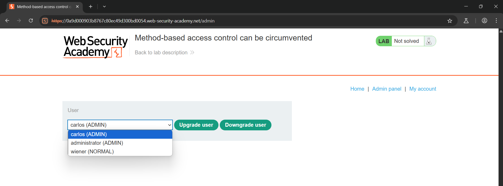
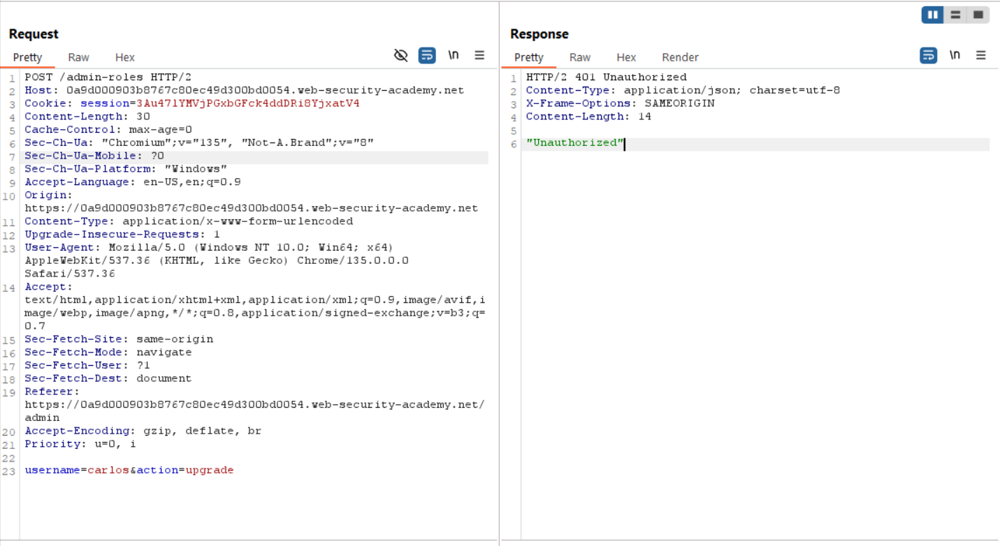
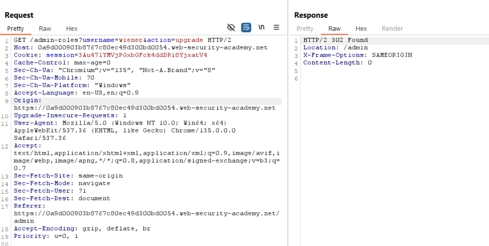
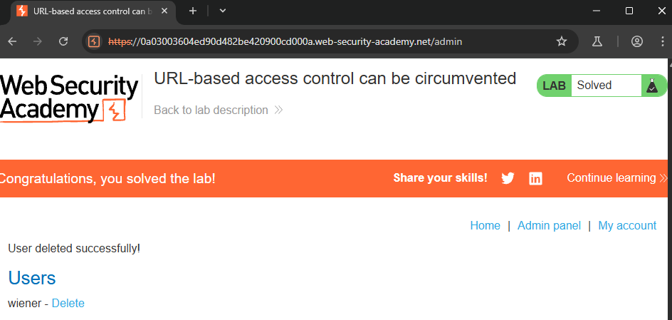

# Lab: Method-based access control can be circumvented
## Target: Promote user's role (carlos)

**URL:** `https://0a9d000903b8767c80ec49d300bd0054.web-security-academy.net/`
## Admin creds: administrator:admin
## Wiener creds: wiener:peter

## 🔎 Solution
1. Log in using the admin credentials.
2. Browse to the admin panel, promote carlos, and send the HTTP request to Burp Repeater.
3. Open a private/incognito browser window, and log in with the non-admin credentials.
4. Attempt to re-promote carlos with the non-admin user by copying that user's session cookie into the existing Burp Repeater request, and observe that the response says "Unauthorized".
5. Change the method from POST to POSTX and observe that the response changes to "missing parameter".
6. Convert the request to use the GET method by right-clicking and selecting "Change request method".
7. Change the username parameter to your username and resend the request.

## ✅ Result: screenshots/result.png

## 🖼️ Screenshot

