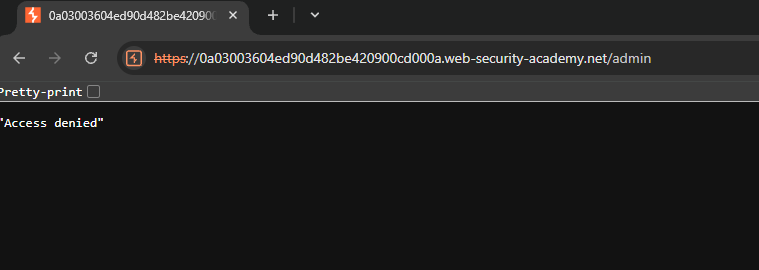
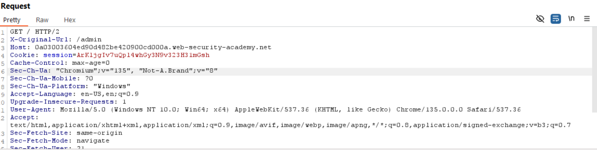

# Lab: URL-based access control can be circumvented
## Target: Access admin panel and delete "carlos"

**URL:** `https://0a03003604ed90d482be420900cd000a.web-security-academy.net/`

## 🔎 Solution
1. Browse to /admin. Observe that you get blocked.
2. Turn on interception. Change HTTP header line to "/" and add "X-Original-Url: /admin". 
3. Forward request. Access to admin panel.
4. To delete carlos, add ?username=carlos to the real query string, and change the X-Original-URL path to /admin/delete

## ✅ Result: screenshots/result.png

## 🖼️ Screenshot

