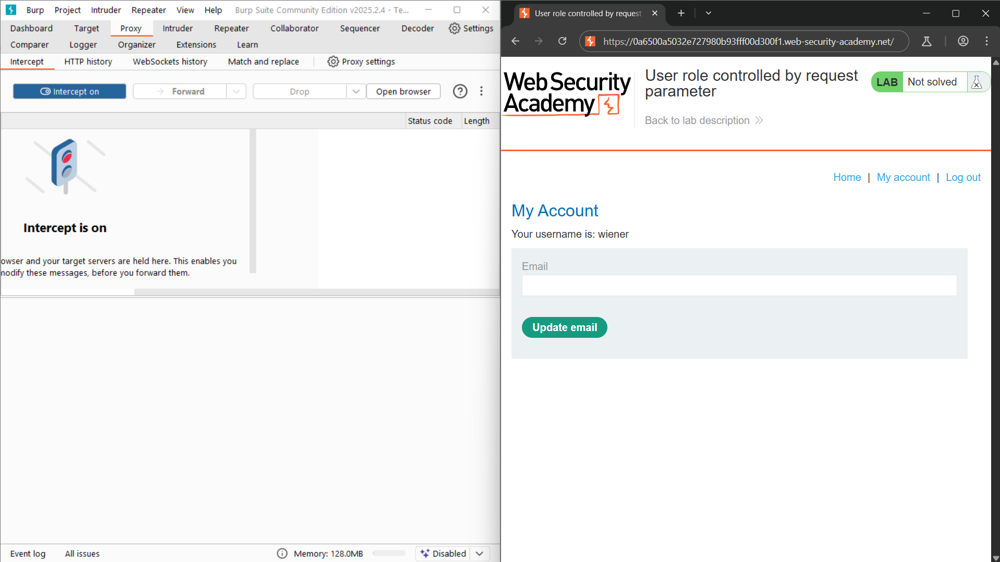
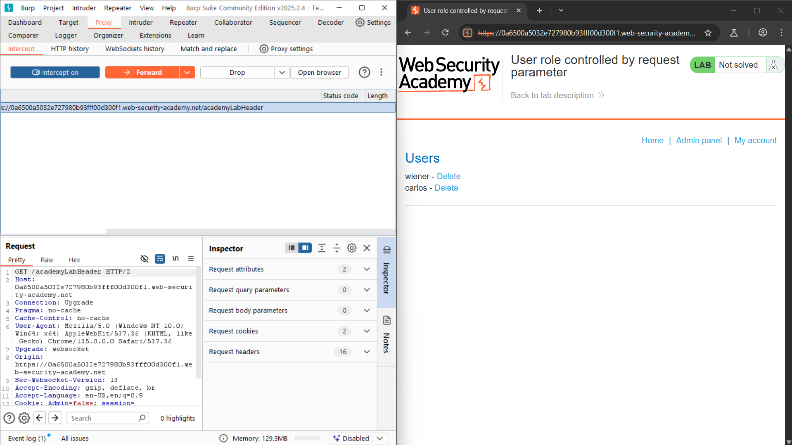
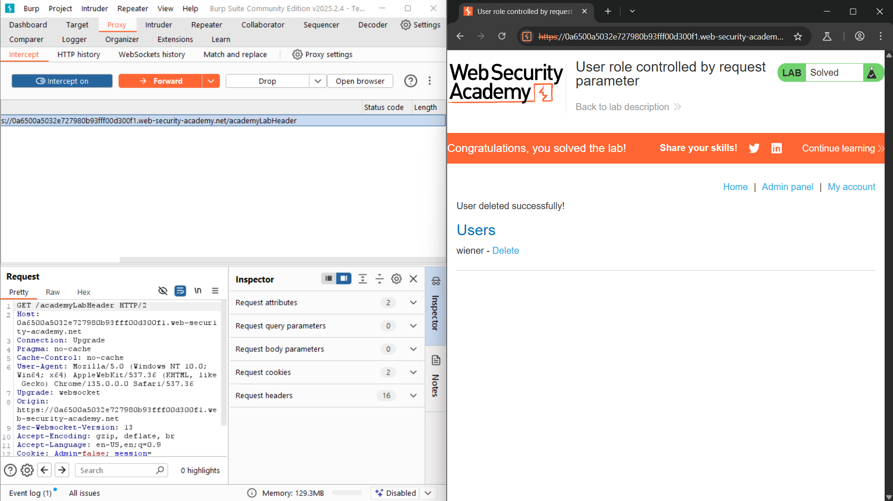

# Lab: User role controlled by request parameter

**URL:** `https://0a6a004e03ec726c802930a400c1005c.web-security-academy.net/`

## Solution
1. In Burp Proxy, turn interception on and enable response interception.
2. Browse to login page, log in to your own account using the following credentials: wiener:peter
3. Browse to /admin, set the cookie "Admin=false". Change it to "Admin=true"
4. Load the admin panel and delete "carlos" user.

## ✅ Result: screenshots/Result.png

## Screenshot

