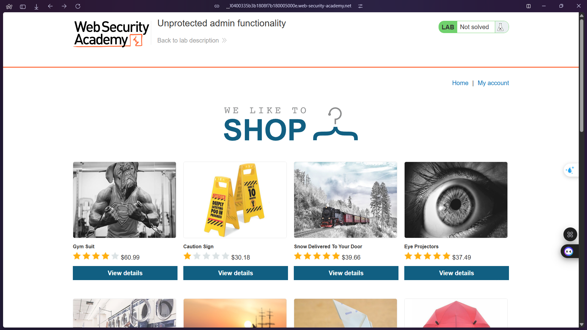
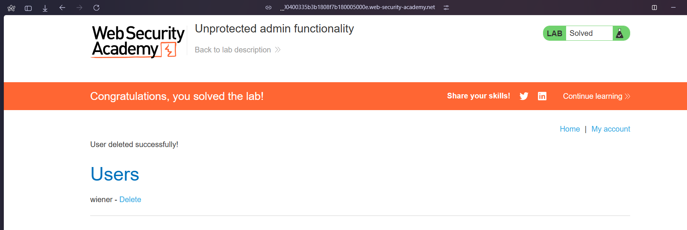

# Lab: Unprotected admin functionality with unpredictable URL

**URL:** `https://0a7b00400335b3b1808f7b180005000e.web-security-academy.net/`

## 🔎 Solution
1. Go to the lab and view "robots.txt" by appending "/robots.txt" to the lab URL. Notice that the Disallow line discloses the path to the admin panel.
2. In the URL bar, replace "/robots.txt" with "/administrator-panel" to load the admin panel.
3. Delete "carlos".

## ✅ Result: screenshots/LabComplete.png

## 🖼️ Screenshot

